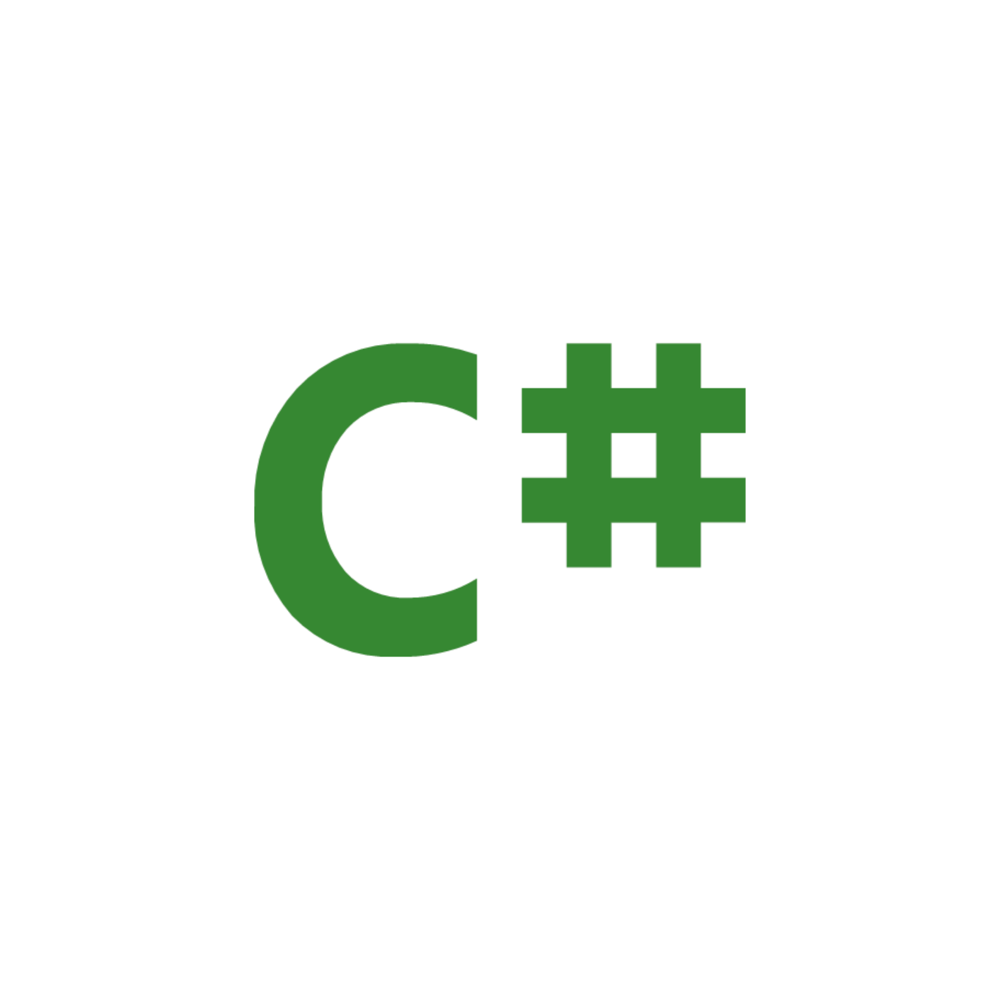

# CSharp-W3Schools

Learn C# C# (C-Sharp) is a programming language developed by Microsoft that runs on the .NET.  

C# is used to develop web apps, desktop apps, mobile apps, games and much more.

  
  

